# 🧠 Codveda Technology — Data Science Internship


> A complete end-to-end Data Science internship project completed at **Codveda Technology**, covering web scraping, data cleaning, exploratory data analysis, machine learning, NLP, time series forecasting, and deep learning.

---

## 📁 Project Structure

```
Data-science-intern/
│
├── LEVEL 1/
│   ├── scraper.py                  # Web scraping with BeautifulSoup
│   ├── books.csv                   # Scraped dataset (1000 books)
│   ├── task2.py                    # Data cleaning & preprocessing
│   ├── iris_cleaned.csv            # Cleaned Iris dataset
│   └── eda.py                      # Exploratory Data Analysis
│
├── LEVEL 2/
│   ├── regression.py               # House price prediction
│   ├── classification.py           # Customer churn classification
│   └── clustering.py               # Customer segmentation
│
├── LEVEL 3/
│   ├── nlp.py                      # Sentiment text classification
│   ├── task1.py                    # Stock price time series
│   └── task3.py                    # Neural network (MNIST)
│
├── images/                         # All output plots
└── README.md
```

---

## 🚀 Level 1 — Basic

### Task 1: Web Scraping
**Goal:** Scrape 1000 books from [books.toscrape.com](http://books.toscrape.com)

**Tools:** `requests`, `BeautifulSoup`, `pandas`

**What was done:**
- Inspected website HTML structure
- Extracted title, price, and rating from each book
- Handled pagination across all 50 pages
- Saved results to `books.csv`

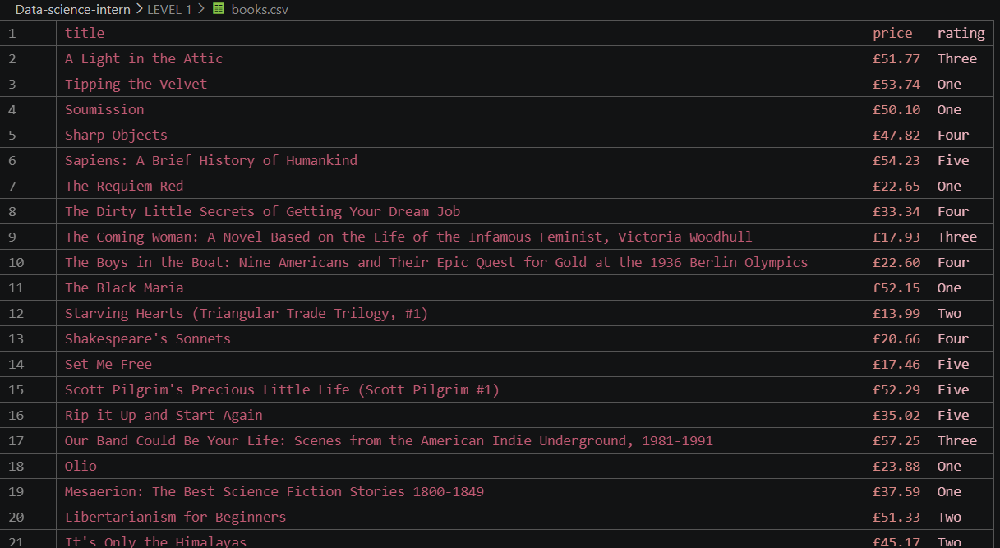

**Result:** 1000 books successfully scraped ✅

---

### Task 2: Data Cleaning & Preprocessing
**Goal:** Clean and preprocess the Iris dataset

**Tools:** `pandas`, `numpy`, `scikit-learn`

**What was done:**
- Handled missing values using median imputation
- Detected and removed outliers using the IQR method
- Encoded the `species` column using Label Encoding and One-Hot Encoding
- Standardized numerical features using `StandardScaler`

**Result:** Clean dataset saved to `iris_cleaned.csv` ✅

---

### Task 3: Exploratory Data Analysis (EDA)
**Goal:** Uncover patterns and trends in the Sentiment dataset

**Tools:** `pandas`, `matplotlib`, `seaborn`

**What was done:**
- Computed summary statistics (mean, median, std)
- Visualized distributions using histograms and box plots
- Analysed sentiment distribution across platforms and countries
- Generated correlation matrix for numerical features

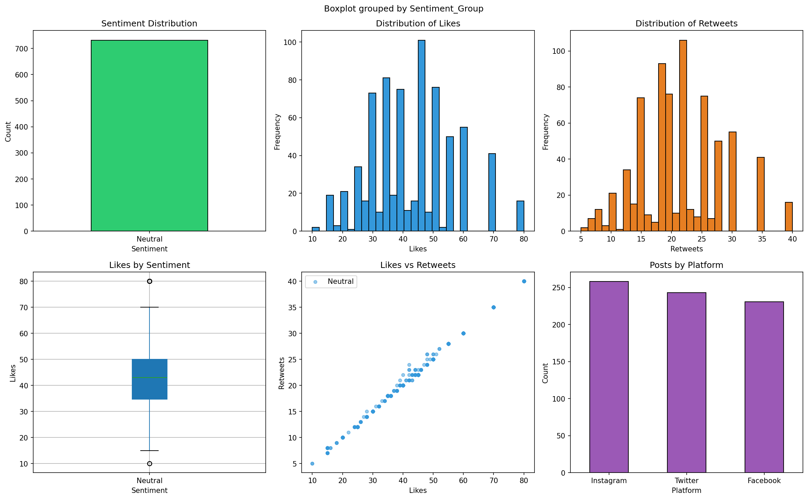

**Key Insight:** Instagram had the most posts; Positive sentiment dominated the dataset ✅

---

## ⚙️ Level 2 — Intermediate

### Task 1: Predictive Modeling (Regression)
**Goal:** Predict house prices using the Boston Housing dataset

**Tools:** `scikit-learn`, `pandas`, `matplotlib`

| Model | RMSE | R² |
|---|---|---|
| Linear Regression | 4.929 | 0.669 |
| Decision Tree | 3.227 | 0.858 |
| **Random Forest** | **2.811** | **0.892** |

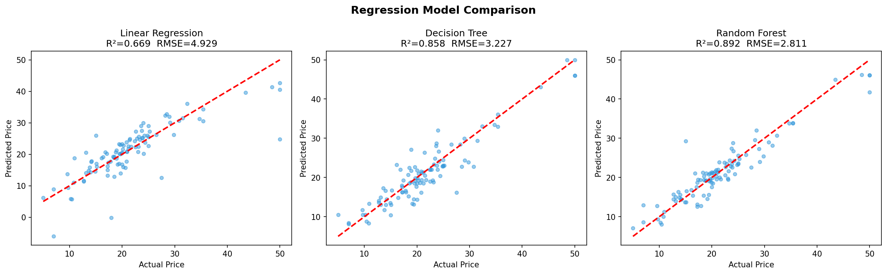
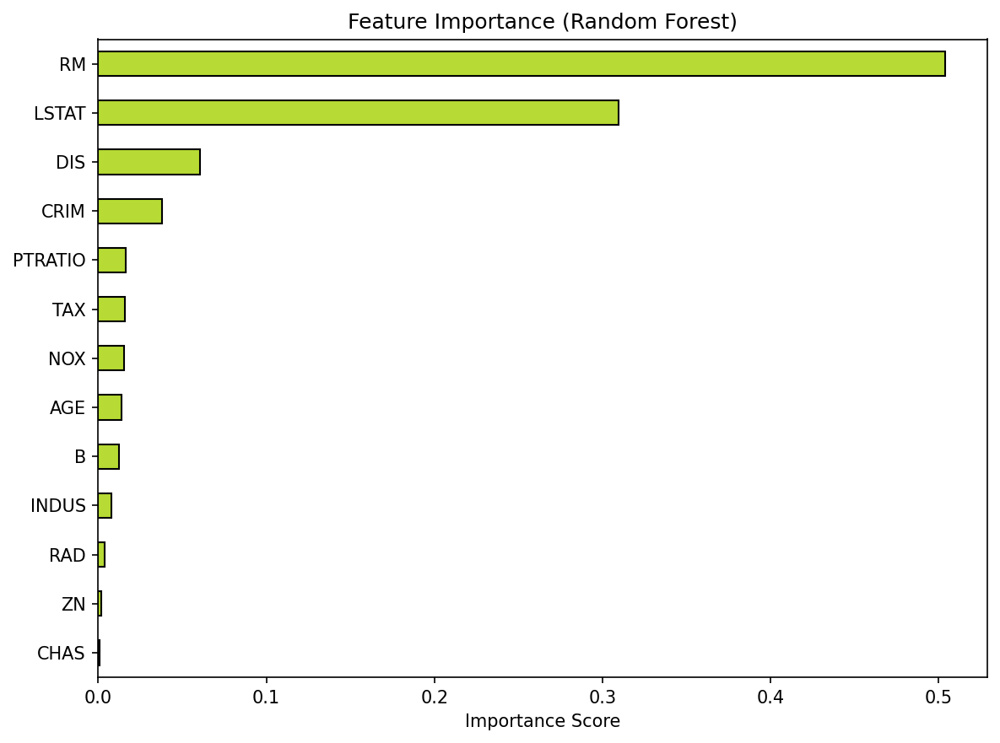

**Best Model:** Random Forest — explains 89.2% of price variance ✅

---

### Task 2: Classification with Logistic Regression
**Goal:** Predict customer churn from telecom data

**Tools:** `scikit-learn`, `pandas`, `matplotlib`

| Model | Accuracy | F1 Score |
|---|---|---|
| Logistic Regression | 85.3% | 0.258 |
| SVM | 91.9% | 0.635 |
| **Random Forest** | **94.6%** | **0.775** |

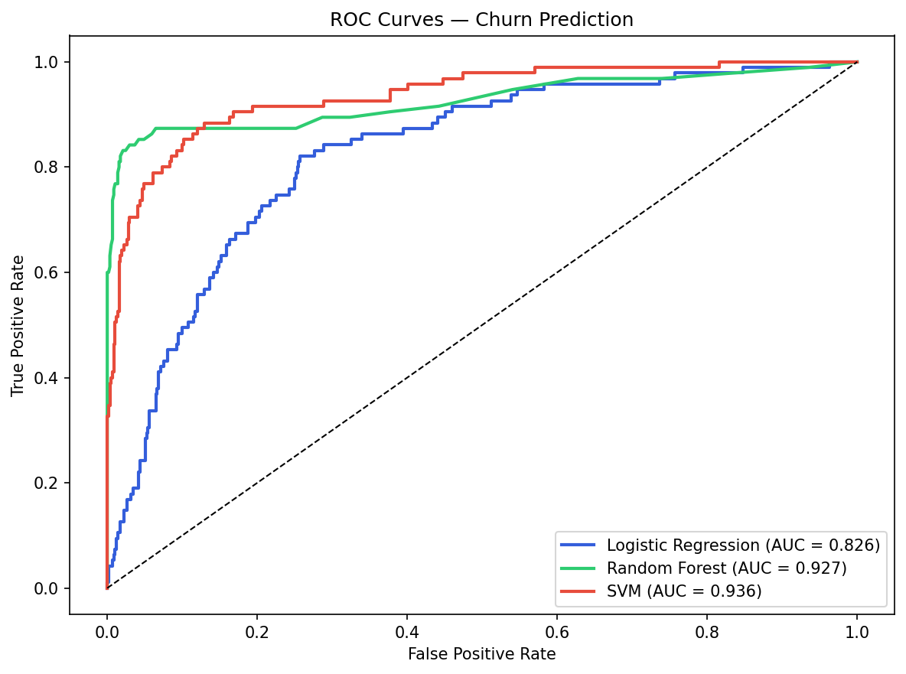
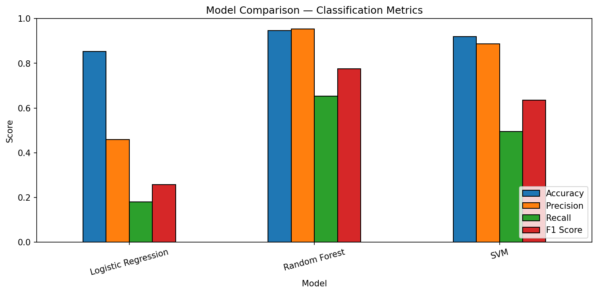

**Best Model:** Random Forest with 94.6% accuracy ✅

---

### Task 3: Clustering (Unsupervised Learning)
**Goal:** Segment telecom customers using K-Means

**Tools:** `scikit-learn`, `matplotlib`, `seaborn`

**What was done:**
- Applied K-Means clustering with K=2 to 10
- Used Elbow Method and Silhouette Score to find optimal K=2
- Visualized clusters using PCA (2D projection)

| Cluster | Size | Churn Rate |
|---|---|---|
| Cluster 0 | 1933 (72%) | 16.7% ⚠️ Higher risk |
| Cluster 1 | 733 (28%) | 8.9% ✅ Lower risk |

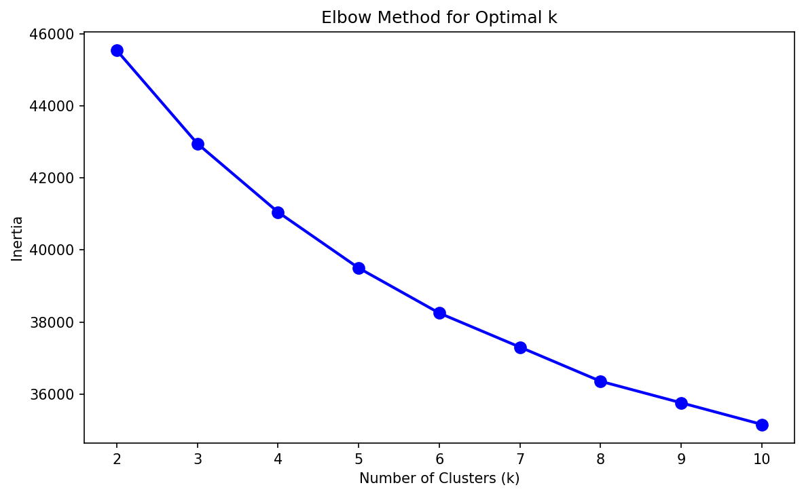
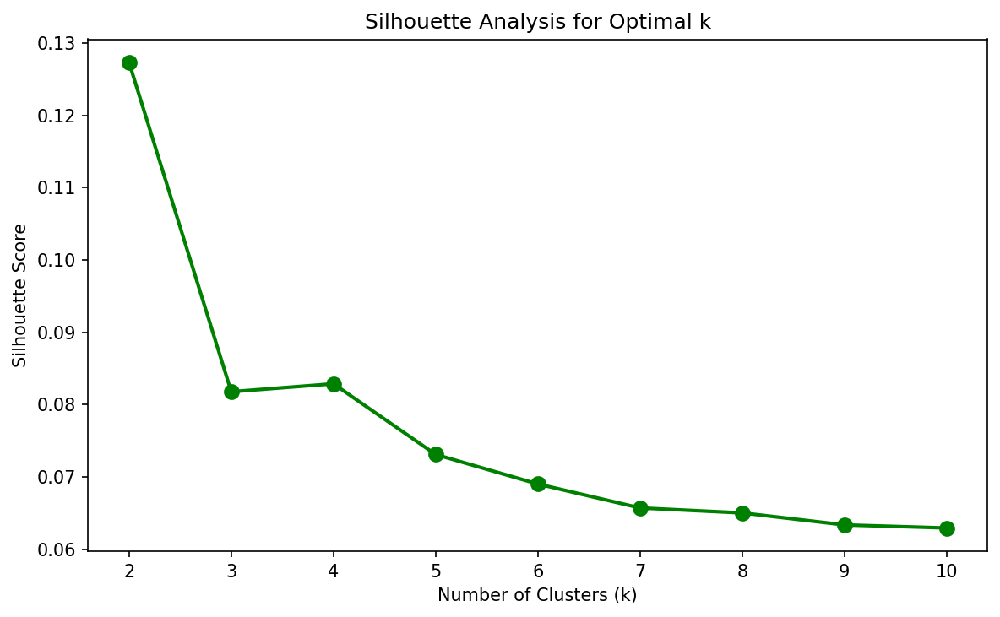
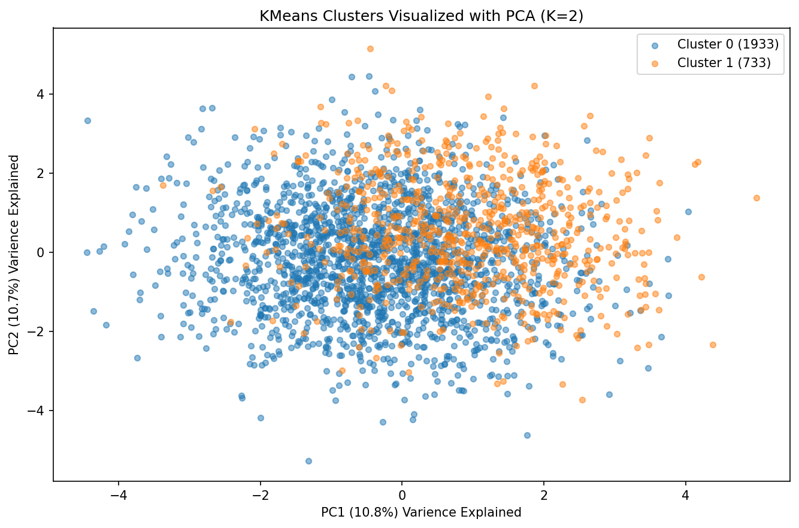

**Key Insight:** K-Means discovered a high-risk and low-risk customer group without labels ✅

---

## 🧪 Level 3 — Advanced

### Task 1: Time Series Analysis
**Goal:** Forecast Apple (AAPL) stock prices using ARIMA

**Tools:** `yfinance`, `statsmodels`, `matplotlib`

**What was done:**
- Downloaded 4 years of AAPL stock data (2020-2024)
- Decomposed time series into trend, seasonality, and residual
- Applied 30-day and 90-day moving averages + EMA
- Built ARIMA(5,1,0) model to forecast 60 days ahead

| Metric | Value |
|---|---|
| RMSE | $14.54 |
| Mean actual price | $183.04 |
| Error % | 7.9% |

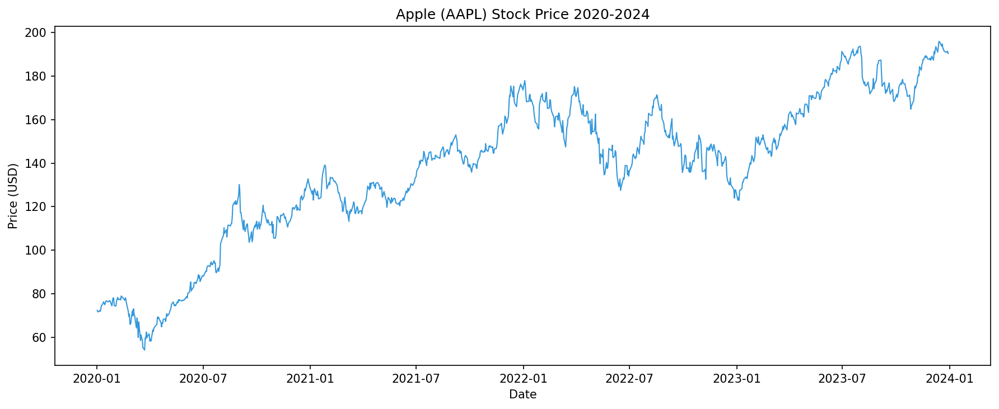
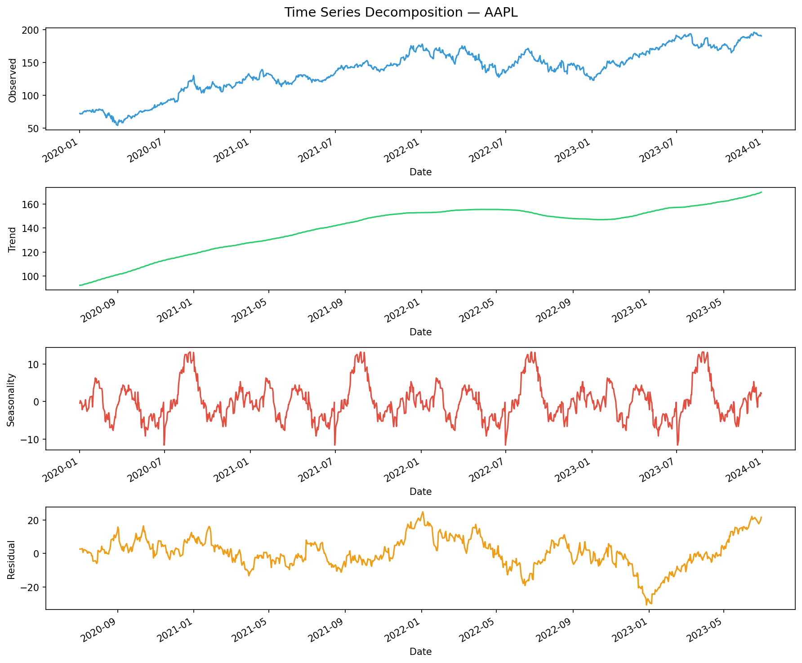
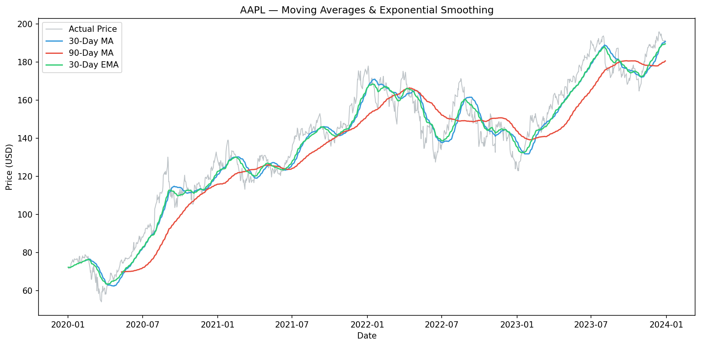
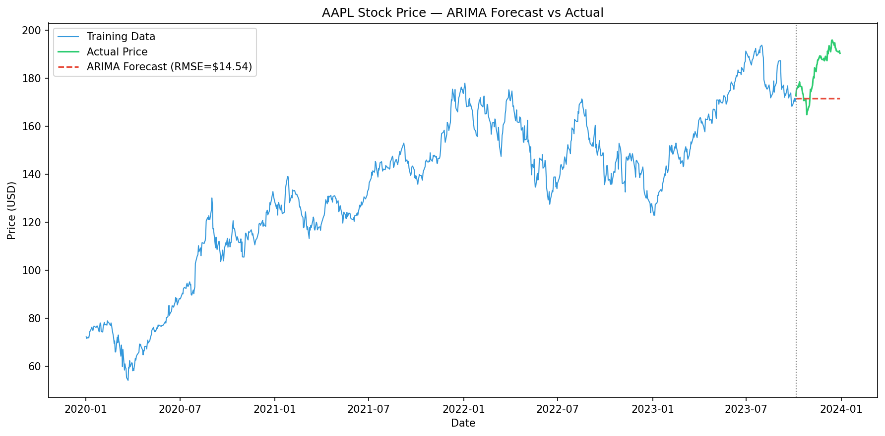

**Result:** ARIMA forecast within 7.9% of actual prices ✅

---

### Task 2: NLP — Text Classification
**Goal:** Classify tweets into Positive, Negative, or Neutral sentiment

**Tools:** `nltk`, `scikit-learn`, `pandas`

**What was done:**
- Cleaned text (lowercasing, removing punctuation, stopwords, stemming)
- Converted text to numerical features using TF-IDF (1000 features)
- Trained Naive Bayes and Logistic Regression classifiers
- Applied `class_weight='balanced'` to handle class imbalance

| Model | F1 Score |
|---|---|
| Naive Bayes | 0.652 |
| **Logistic Regression** | **0.771** |

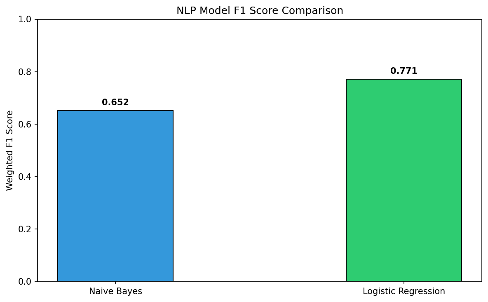

**Best Model:** Logistic Regression with balanced class weights ✅

---

### Task 3: Neural Networks with TensorFlow/Keras
**Goal:** Classify handwritten digits using a feed-forward neural network

**Tools:** `TensorFlow`, `Keras`, `matplotlib`

**Architecture:**
```
Input Layer  → 784 neurons  (28×28 flattened image)
Hidden Layer → 128 neurons  (ReLU activation)
Hidden Layer →  64 neurons  (ReLU activation)
Output Layer →  10 neurons  (Softmax — digits 0-9)
Total Parameters: 109,386
```

**Training Results:**

| Epoch | Train Accuracy | Val Accuracy |
|---|---|---|
| 1 | 92.6% | 96.9% |
| 5 | 98.6% | 97.8% |
| 10 | 99.3% | 97.8% |

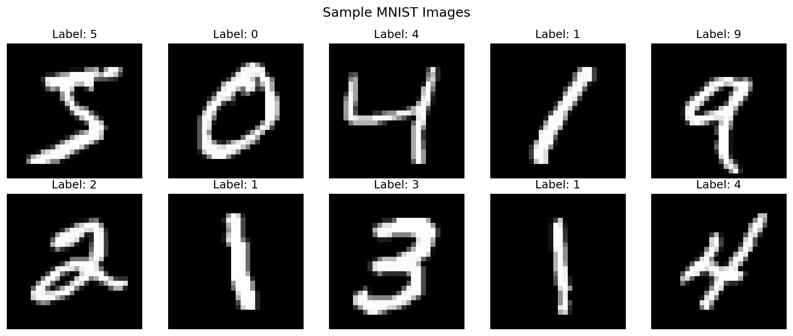
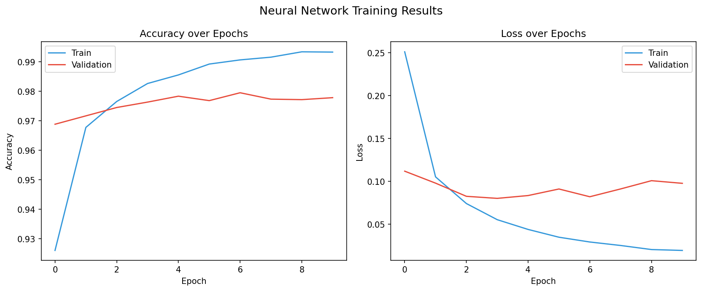
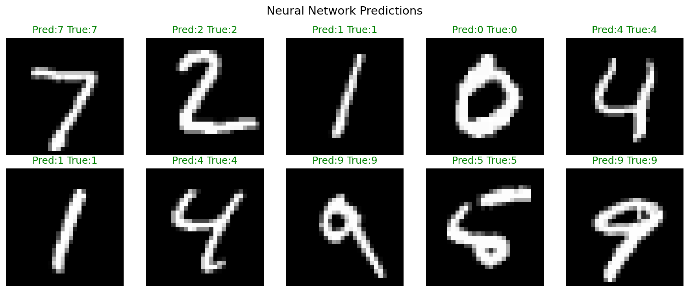

**Final Test Accuracy: 97.59%** — correctly identified 9,759 out of 10,000 digits ✅

---

## 🛠️ Installation & Setup

```bash
# Clone the repository
git clone https://github.com/YOUR_USERNAME/codveda-data-science-internship.git
cd codveda-data-science-internship

# Install all dependencies
pip install requests beautifulsoup4 pandas numpy scikit-learn
pip install matplotlib seaborn statsmodels yfinance nltk
pip install tensorflow
```

---

## 📊 Results Summary

| Level | Task | Best Model | Key Metric |
|---|---|---|---|
| 1 | Web Scraping | BeautifulSoup | 1000 books scraped |
| 1 | Data Cleaning | StandardScaler + IQR | 0 missing values |
| 1 | EDA | Seaborn/Matplotlib | Insights visualized |
| 2 | Regression | Random Forest | R² = 0.892 |
| 2 | Classification | Random Forest | F1 = 0.775 |
| 2 | Clustering | K-Means (K=2) | 2 risk groups found |
| 3 | Time Series | ARIMA(5,1,0) | RMSE = $14.54 |
| 3 | NLP | Logistic Regression | F1 = 0.771 |
| 3 | Neural Network | 3-Layer Dense NN | Accuracy = 97.59% |*veryyy interesting*

---

## 👤 Author

- LinkedIn:[linkedin.com/in/halalisani-thusi]
- GitHub: [ThusiHalalisani08]

---

## 🏢 About Codveda Technology

Codveda Technology is an innovative IT solutions company specializing in web development, app development, digital marketing, AI/ML automation, and data analysis.

`#CodvedaJourney` `#CodvedaExperience` `#FutureWithCodveda`
